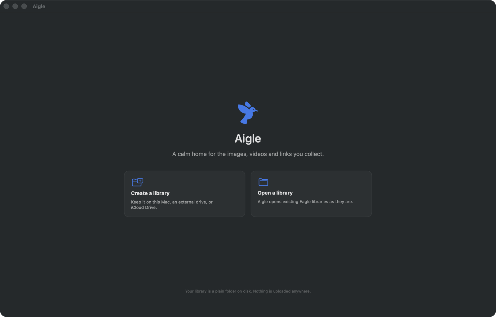

# Aigle

A native SwiftUI app for macOS that gives the images, videos, PDFs and links you
collect a calm place to live. Open source, local-first, and file-format
compatible with [Eagle](https://en.eagle.cool) — point it at an existing Eagle
library and it just opens.



## What it does

- **Justified grid** with trackpad-pinch, ⌘-scroll, ⌘+/⌘− and slider zoom that
  keeps your place while the cells resize.
- **Space to peek.** Space opens whatever is under the cursor — no selection
  needed — and the arrow keys flip through items without a white flash.
- **Shared transitions.** Items expand out of their cell and collapse back into
  it via `matchedGeometryEffect`, with a reduced-motion path for everyone who
  wants one.
- **Collections** with nesting, drag-to-file, alphabetical sort, and per-view
  custom order you can drag into shape.
- **Likes** with ⌥-click straight from the grid, corner badges, and a smart
  section in the sidebar.
- **Connected folders** referenced in place — never copied — watched with
  FSEvents and indexed in the background so they open instantly.
- **⌘K search** across the library *and* every connected folder, with fuzzy
  matching over names and tags.
- **⌘T tagging** from anywhere, including multi-select.
- **Virtual copies.** Re-adding a file you already have creates a second entry
  pointing at the same bytes instead of nagging you or duplicating the file.
- **Real format support:** images, animated GIFs, SVG, PDF, video (with an
  in-place player), plus a Quick Look fallback for everything else.
- **Video in the grid and in the expanded view** — scrub the timeline, `P`
  play/pause, `A`/`D` step a frame, `M` mute, `⌘⇧S` save the exact frame to
  your Inbox as a new image.
- **Links.** Paste or drop a URL and Aigle fetches the title and best preview
  image, then treats it like any other item.
- **Menu bar drop target.** Drop files or links on the menu bar icon and they
  land in the Inbox, even with the main window closed.
- **Two browser extensions** — a Safari extension built into the app, and a
  Chrome MV3 extension in [`extension/`](extension/).
- **Endlessly customisable:** spacing, corner radius, background, appearance,
  thumbnail fit, default zoom, selection colour, badges, autoplay, and more —
  all applied live.
- **Eight languages** via String Catalogs: English, French, German, Spanish,
  Italian, Ukrainian, Simplified Chinese, Japanese and Brazilian Portuguese.

## Setup assistant

First launch opens a setup assistant that walks through choosing a library,
verifying what Aigle can reach, pre-authorising the folders you collect from,
and switching on the browser extensions.

It is persistent in two senses. Progress is saved, so quitting halfway through
and relaunching resumes on the same step. And it never goes away: it is
reachable afterwards from **Help → Setup Assistant**, its checklist lives on in
**Settings → Setup**, and a library that stops resolving — moved, renamed, an
external drive unplugged, permission revoked — brings the assistant back on its
own instead of failing silently later.

Every row on the Permissions step is a live probe, re-run whenever Aigle comes
back to the front, because these things change outside the app:

| Check | How it's actually tested |
| --- | --- |
| Write permission | Writes and deletes a probe file in the library folder. `isWritableFile` consults POSIX bits and misses sandbox and TCC denials. |
| Permission remembered | Resolves the stored security-scoped bookmark and confirms the folder is still there — this is what decides whether the library reopens next launch. |
| Storage location | Classifies the path as iCloud Drive, Dropbox, Google Drive, OneDrive, or an external volume. |
| Folder access | Resolves each pre-authorised folder's bookmark. |
| Local port | Binds `127.0.0.1:<port>` for a moment to see whether the Chrome bridge could claim it. |
| Safari extension | Asks Safari for the extension's real enabled state. |

Nothing here reports "granted" from a flag remembered from an earlier answer.

Safari's framework is loaded on demand rather than linked, so a user who never
opens the Safari step doesn't pay for it at launch — and because linking it
makes the Objective-C runtime's `realizeAllClasses()` pass, which XCTest
triggers when it injects the test bundle, crash under this app's Enhanced
Security / arm64e configuration.

## Your library is just a folder

A library is a folder named `Something.library` laid out exactly the way Eagle
lays one out:

```
Something.library/
  metadata.json          collections tree, app version
  tags.json              tag history
  mtime.json
  images/
    KZ7X2M9QW1ABC.info/
      metadata.json      id, name, ext, tags, folders, size, dimensions, …
      sunset.jpg         the original file, untouched
      sunset_thumbnail.png
  .aigle/                Aigle's own sidecar: launch index, thumbnail cache
```

Aigle's extra fields (likes, custom order, virtual copies) live in a namespaced
`aigle` sub-object inside each item's `metadata.json`, and anything Eagle wrote
that Aigle doesn't model is round-tripped untouched. Opening a library in Aigle
never costs you data in Eagle, and vice versa.

Put the folder wherever you like — internal disk, an external drive, Dropbox, or
iCloud Drive. All reads and writes go through `NSFileCoordinator`, and
undownloaded iCloud files are fetched on demand. Access is remembered across
launches with security-scoped bookmarks; the app is sandboxed.

## Build and run

Requirements: **Xcode 26.6+**, **macOS 26.0+**, and
[xcodegen](https://github.com/yonaskolb/XcodeGen) (`brew install xcodegen`).
There are no third-party dependencies — Apple frameworks only.

```bash
xcodegen generate
xcodebuild -project Aigle.xcodeproj -scheme Aigle build
xcodebuild -project Aigle.xcodeproj -scheme Aigle test
```

Then open `Aigle.xcodeproj` and run, or launch the built app:

```bash
open "$(xcodebuild -project Aigle.xcodeproj -scheme Aigle -showBuildSettings \
  | awk -F'= ' '/ BUILT_PRODUCTS_DIR/{print $2; exit}')/Aigle.app"
```

`Aigle.xcodeproj` is generated and not checked in — `project.yml` is the source
of truth. Re-run `xcodegen generate` after adding files.

### The 50 000-item performance pass

A separate suite builds a real 50 000-item library on disk and times the four
things you feel. It is skipped unless you ask for it:

```bash
TEST_RUNNER_AIGLE_PERF=1 xcodebuild -project Aigle.xcodeproj -scheme Aigle test \
  -only-testing:AigleTests/PerformanceSuite
```

Debug-build numbers on an Apple silicon Mac:

| Step | Time |
| --- | --- |
| Warm launch (persisted index) | 0.21 s |
| Cold open (full directory scan + index write) | 2.35 s |
| Justified layout of 50 000 items | 0.03 s |
| ⌘K search across 50 000 items | 0.22 s |

## Keyboard

| Shortcut | Action |
| --- | --- |
| `Space` | Open the hovered (or selected) item; press again to close |
| `←` `→` `↑` `↓` | Move the selection; inside the expanded view, flip items |
| `Return` | Open the selection |
| `Esc` | Clear the selection, or close the expanded view |
| `⌘K` | Search everything |
| `⌘T` | Tag the selection |
| `⌘L` | Like / unlike |
| `⌘N` | New collection |
| `⌘I` | Import files |
| `⌘⇧O` | Connect a folder |
| `⌘R` | Reveal in Finder |
| `⌘⌫` | Move to trash |
| `⌘+` `⌘−` | Zoom the grid |
| `⌘,` | Settings |
| `P` `A` `D` `M` | Video: play/pause, previous frame, next frame, mute |
| `⌘⇧S` | Save the current video frame to the Inbox |

Mouse and trackpad: ⌥-click to like, ⌘-click and ⇧-click to extend a selection,
drag on empty space to rubber-band select, pinch or ⌘-scroll to zoom, and hold
`Space` (or the middle mouse button) and drag to pan.

## Browser extensions

**Safari** is built into the app. Turn it on in Settings → Extensions, which
deep-links to Safari's extension preferences. It talks to the app through its
native messaging handler.

**Chrome** lives in [`extension/`](extension/) as an unpacked MV3 extension. The
app runs a listener bound to `127.0.0.1` only — off by default, gated by a
random token shown in Settings. See [`extension/README.md`](extension/README.md)
for setup and a `curl` recipe.

## Security posture

- App Sandbox on, with `files.user-selected.read-write` and app-scoped
  bookmarks.
- Hardened Runtime plus Enhanced Security v2: `ENABLE_ENHANCED_SECURITY`,
  pointer authentication (the app ships arm64e), a hardened heap, read-only
  dyld state, and platform restrictions v2.
- The extension listener binds the loopback address explicitly, never the
  wildcard, and rejects any request without the current token.
- No analytics, no accounts, no network calls except fetching link previews and
  media you explicitly asked Aigle to save.

## Not included

By design: no iOS companion app, no MCP support, and no Canvas / Infinity view
modes. Grid is the only view mode.

## Licence

MIT.
